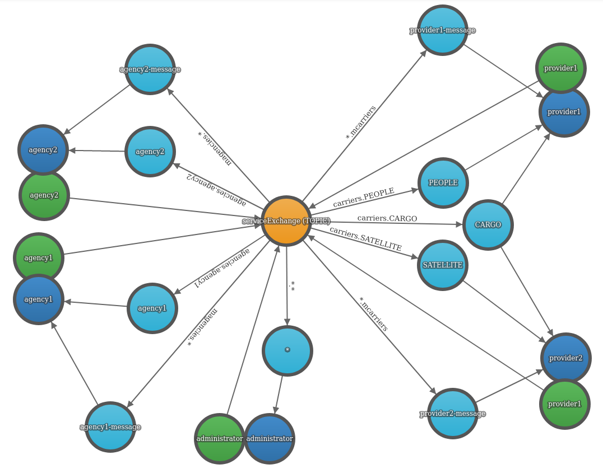

# DISTRIBUTED SYSTEMS

This repository contains 6 exercises for AGH Course. Most of them are written in Kotlin and Scala.

## Subjects

### 1. Sockets

Simple chat app using sockets

### 2. RESTapi

RESTapi server using KTOR, which works both as a client and a server. As a server, it serves the simple html form to query
the news from some News Apis. As a client, it calls the remote News Apis and present results.

### 3. RabbitMQ

Publish subscribe pattern implemented with RabbitMQ. Below image presents the architecture

### 4. Middleware

#### 1. GRPC

Publish subscribe pattern using GRPC. Written in Kotlin and Scala. I think it's great example how to use just released Kotlin GRPC compiler, which generates
class files using coroutines. Also it presents how to setup grpc protobuf gradle plugin in kts

#### 2. Thirft

Smarthouse simulation using Thirft RPC. Written in Kotlin and Scala. 